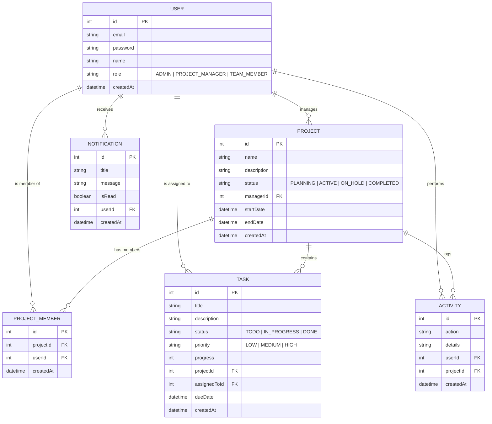
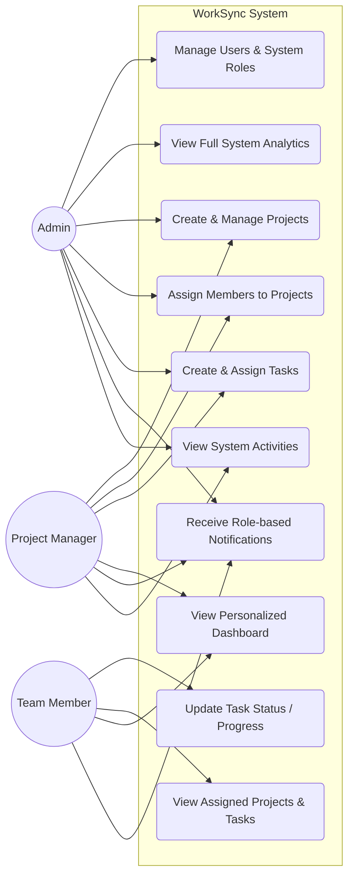
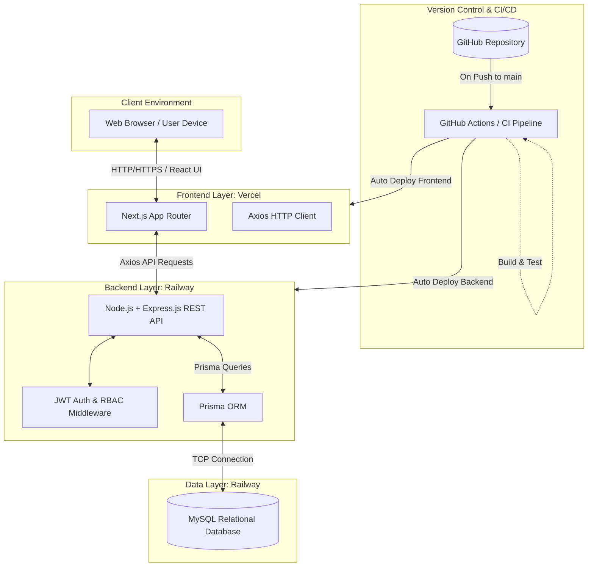

# WorkSync System Diagrams

These diagrams are written in **Mermaid.js** format and will render automatically when viewed on GitHub.

---

## 1. Entity Relationship Diagram (ERD)

This diagram illustrates the core database structure and relationships between Users, Projects, and Tasks.

---

## 2. Use Case Diagram

This diagram shows the main actors (Admin, Project Manager, Team Member) and the actions they are permitted to perform within the system.

---

## 3. Basic System Architecture Diagram

This diagram outlines how the Frontend, Backend, and Database interact with each other in the live deployment environment.

